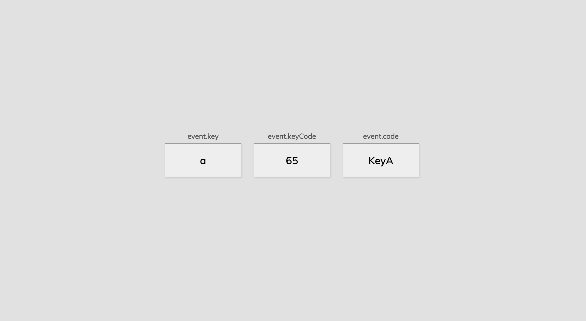

# 50 Projects in 50 Days - Event Keycodes

This is a code along project in the [50 Projects In 50 Days - HTML, CSS & JavaScript Udemy Course](https://www.udemy.com/course/50-projects-50-days/). Sharpen your skills by building 50 quick, unique & fun mini projects.

## Table of contents 😌

- [Overview](#overview)
  - [The project](#the-project)
  - [Screenshot](#screenshot)
  - [Links](#links)
- [My process](#my-process)
  - [Built with](#built-with)
  - [What I learned](#what-i-learned)
  - [Continued development](#continued-development)
  - [Code snippets](#im-really-proud-of-these-code-snippets%EF%B8%8F)
  - [Useful resources](#useful-resources)
- [Author](#author)
- [Acknowledgments](#acknowledgments)

## Overview👋🏾

Welcome to the 11<sup>th</sup> mini-project of the course!

### The project😥

In this project users will be able to:

- Build a responsive site that displays a functional progress bar.

### Screenshot🌇



### Links👩🏾‍💻

- Solution URL: (https://github.com/MaianneThornton/50in50_EventKeycodes)
- Live Site URL: (https://majestic-kashata-f0e4c1.netlify.app/)

## My process💭

This is a simple project that I started by marking out initial classes in the html file to be later used for styling. Next I began styling the css by styling the div's that will display the information. I removed the hardcoded div's I used to be able to style so that I could add functionality via JavaScript. I then added functionality by way of JavaScript to display the key, keycode and code of the key pressed by the user.

### Built with👷🏾‍♀️

- Semantic HTML5 markup
- CSS custom properties
- Flexbox
- JavaScript

### What I learned👩🏾‍🏫

I learned that the Keyboard Event property represents a physical key on the keyboard (as opposed to the character generated by pressing the key).

I also learned that window is the top level object in the browser. Adding an eventlistener to this object will "listen" on the entire window for the action.

### Continued development🔮

I also plan on continuing to practice using different event listeners to make my pages more functional.

I plan on practicing using more ternary's to strengthen my conditional statement skills.

I also plan on continuing to learn the best ways to phrase git commits, so that future viewers can fully understand the changes that have occurred.

### I'm really proud of these code snippets✂️

```js
window.addEventListener('keydown', (event) => {
  console.log(event);

  insert.innerHTML = `
  <div class="key">
  ${event.key === ' ' ? 'Space' : event.key}
        <small>event.key</small>
      </div>

      <div class="key">
        ${event.keyCode}
        <small>event.keyCode</small>
      </div>

      <div class="key">
        ${event.code}
        <small>event.code</small>
      </div>
  `;
});
```

### Useful resources📖

- [Resource 1](https://www.toptal.com/developers/keycode) - This is the site that this project is based on.
- [Resource 2](https://developer.mozilla.org/en-US/docs/Web/API/KeyboardEvent/keyCode) - This is the MDN document that details the <strong>deprecated</strong> KeyboardEvent.keyCode Property.
- [Resource 3](https://developer.mozilla.org/en-US/docs/Web/API/KeyboardEvent/code) - This is the MDN document that details the KeyboardEvent.code Property.

## Author🔎

- Website - [Portfolio Site](https://www.maiannethornton.com/Portfolio/index.html)
- Frontend Mentor - [@MaianneThornton](https://www.frontendmentor.io/profile/MaianneThornton)
- GitHub - [@MaianneThornton](GitHub.com/MaianneThornton)
- Twitter - [@MaianneThornton](https://twitter.com/MaianneThornton)
- LinkedIn - [@MaianneThornton](https://www.linkedin.com/in/maiannethornton/)

## Acknowledgments🙏🏾

Special Thanks go to [Brad Traversy](http://www.traversymedia.com/) and [Florin Pop](http://www.florin-pop.com/) creating the course and making reviewing concepts fun 😊.
